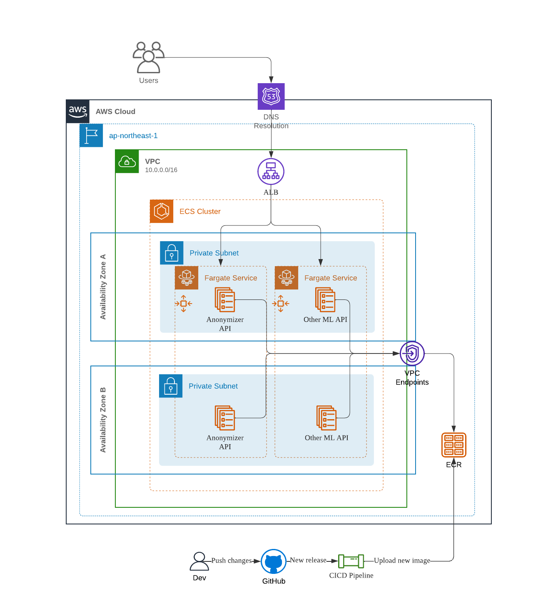

# Anonymizer API

Streamline the process of building and deploying an inference API on AWS using FastAPI, Docker and Github actions.

API loads spacy NLP model to anonymize information given user input.

## Example Request

Request to API: `POST: {{APP_ENDPOINT}}/anoymize/` with body -

``` json
{
    "text": "My son's name is ShuSaku and he is 180cm tall. We live happily in Seoul.",
    "model_language": "en",
    "model_size": "sm"
}
```

Reponse from API: `200 OK` with body -

```json
{
    "entities": [
        {
            "start": 17,
            "end": 24,
            "type": "GPE",
            "text": "ShuSaku"
        },
        {
            "start": 35,
            "end": 40,
            "type": "QUANTITY",
            "text": "180cm"
        },
        {
            "start": 66,
            "end": 71,
            "type": "GPE",
            "text": "Seoul"
        }
    ],
    "anonymized_text": "My son's name is XXXXXXX and he is XXXXX tall. We live happily in XXXXX."
}
```

## Infra Architecture

All infrastructure code using Terraform is located in my another repository - [ml-infra-aws](https://github.com/mchen50/ml-infra-aws) (may not be open to public access).

The following diagram describes where this API will be run -



## New Releases

To make a new release -

1. Use Github Releases and create a new tag with format: v[major].[minor].[patch]

    ex. v1.3.18

2. Deploy workflow will be triggered automatically to build, push the image to ECR.

3. In `ml-infra-aws` repo, update image tag in `infra/config/${STAGE}/${REGION}/service.tfvars`:

    ```hcl
    anonymizer_api_task = {
        image_tag = "v1.3.18"
    }
    ```

4. Trigger `ml-infra-aws` repo terraform deploy pipeline to apply the new changes.
    A new task definition will be created and a new ECS task with the new release image will be deployed.

## Local Development Notes

Pre-requisites:

```
pyenv<python, pip>, make, pipenv, docker, docker-compose
```

To setup:

```
make activate-venv
make setup
```

To serve the API using pipenv:

```
make serve-local
```

To run the API in docker:

```
make compose-up
```
